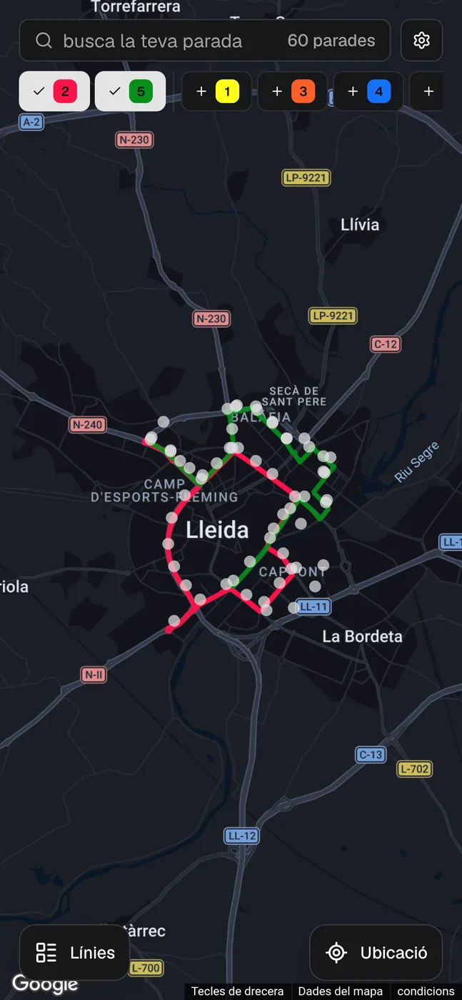
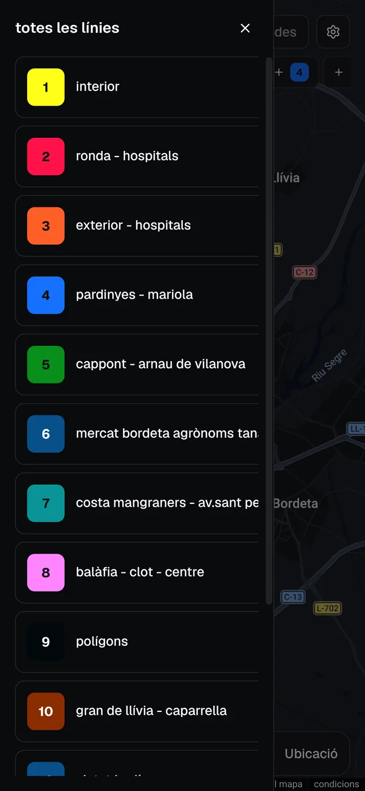
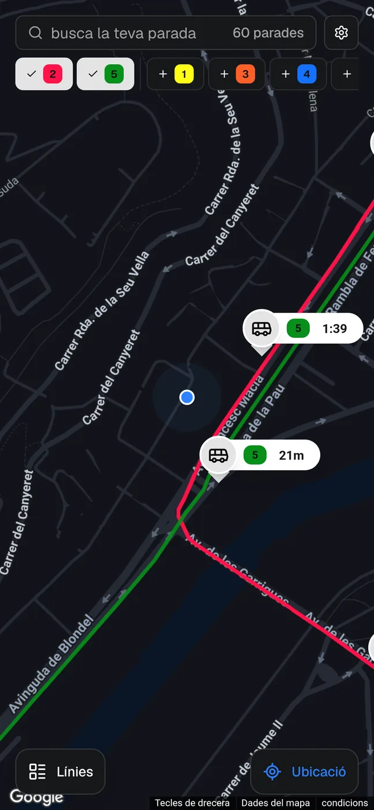
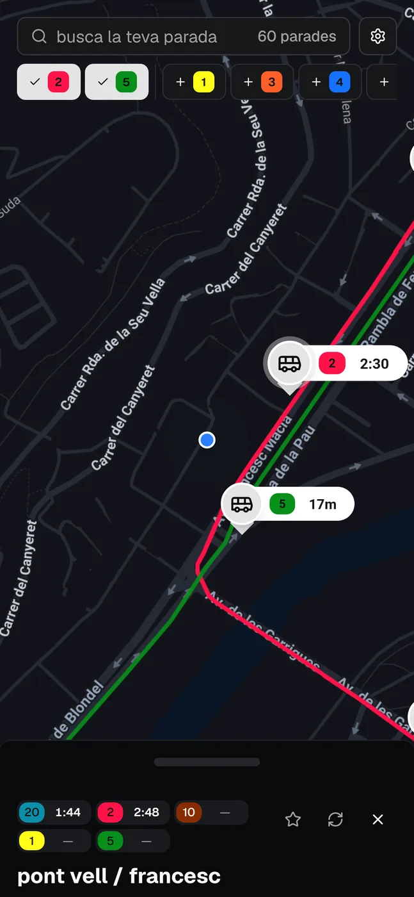
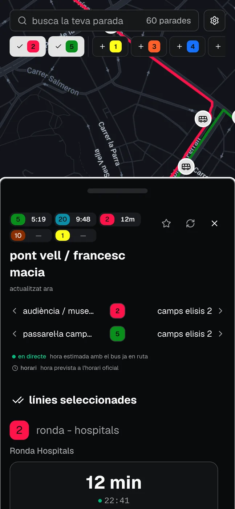
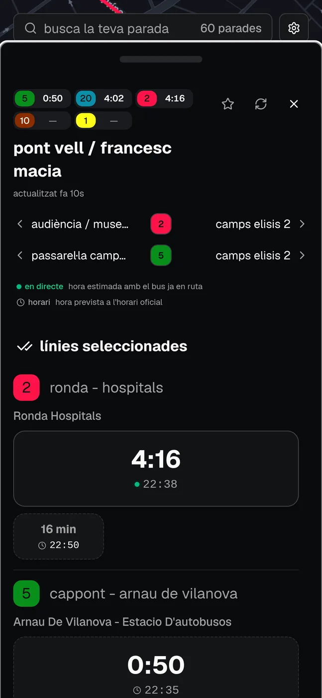
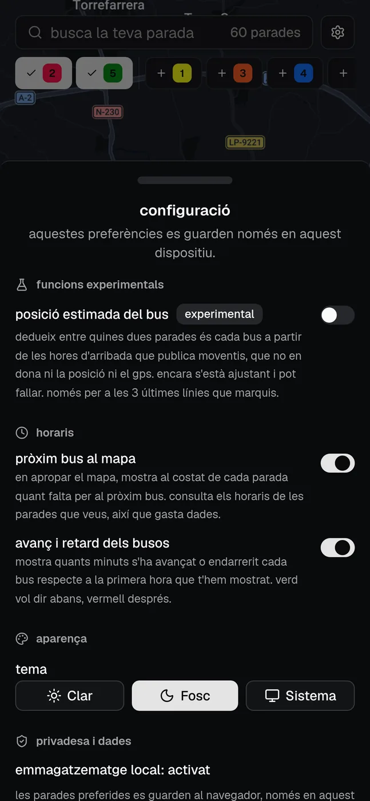

<div align="center">


# moventis lleida

els busos urbans de lleida, en directe i sobre el mapa.

[moventis-lleida.joeltaylor.business](https://moventis-lleida.joeltaylor.business)

</div>

el web oficial de moventis es consulta gairebé sempre des del mòbil, dret a la parada, i des d'allà costa de fer servir. aquí tries les línies que t'interessen, toques la parada i veus quan arriba el bus. les dades són les mateixes: surten de l'api pública de moventis.

## com es veu

|                                                                                                                                                                                              |                                                                                                                                                                                                                    |
| -------------------------------------------------------------------------------------------------------------------------------------------------------------------------------------------- | ------------------------------------------------------------------------------------------------------------------------------------------------------------------------------------------------------------------ |
| <br>tries línies a la tira de dalt i el mapa es queda amb les seves parades.              | <br>la xarxa sencera, amb el color que després identifica cada línia al mapa.                                           |
| <br>on ets ara. de prop, cada parada porta quant falta per al pròxim bus. | <br>arrapat a baix: el nom i el pròxim bus de cada línia, i el mapa encara es fa servir. |
| <br>a mitja alçada hi caben les parades veïnes de cada línia i què vol dir cada hora.    | <br>obert del tot: una targeta per bus, amb el compte enrere i l'hora d'arribada.                                                    |

## com funciona

les dades arriben per dos camins amb ritmes molt diferents.

**línies, parades i dies de servei.** `apps/scraper` les descobreix cada nit a les 03:00 i les desa a postgresql. el web les llegeix d'allà amb una cache d'una setmana, així que el mapa es dibuixa sense tocar moventis.

**arribades.** es demanen a moventis en el moment que obres una parada i no es guarden enlloc. cada arribada ve marcada com a hora real (un desplaçament, `5 min 30 s`) o com a hora d'horari (un rellotge, `14:35`), i totes dues es normalitzen a `Date`. moventis parla sempre en hora de lleida i els servidors van en utc, de manera que la conversió passa per `zoned-time.ts` i mai per `setHours`.

quatre coses que no es veuen a la interfície:

- si la consulta d'una línia falla, la parada mostra la resta i marca quina falta. només si fallen totes es tracta com un error, perquè una caiguda no pot semblar "avui no passa cap bus".
- cada arribada recorda la primera predicció que en vam rebre i ensenya quant s'ha desviat des de llavors (`▲ +2 min`).
- la posició dels busos al mapa es dedueix per encaix: moventis no publica ni gps ni identificador de vehicle, així que un bus que surt a la llista de la parada B i no a la de la parada A anterior és entre les dues. va apagada per defecte.
- la selecció viu a la url (`/?lines=1,4&stop=10211`) amb els identificadors públics de moventis, no amb els interns, de manera que un enllaç compartit sobreviu a una reconstrucció de la base de dades.

<div align="center">

</div>

tot això s'apaga des de la configuració, que es desa al dispositiu i no demana cap compte.

## estructura

| ruta              | què hi ha                                                  |
| ----------------- | ---------------------------------------------------------- |
| `apps/web`        | next.js 15: el mapa, el calaix de parada i la configuració |
| `apps/scraper`    | la sincronització nocturna de línies, parades i calendari  |
| `apps/expo`       | app react native, encara molt inicial                      |
| `packages/api`    | routers trpc i tota la lògica                              |
| `packages/db`     | client i esquema de prisma                                 |
| `packages/shared` | tipus, esquemes zod, constants i geometria                 |
| `tooling/*`       | configuració compartida d'eslint i typescript              |

## posar-ho en marxa

cal node 22 (`.nvmrc`), pnpm 9 i una base de dades postgresql. `docker-compose.dev.yml` en puja una de local si no en tens.

```sh
pnpm install --frozen-lockfile
cp .env.example .env        # DATABASE_URL i les claus de google maps
pnpm --filter @moventis/db db:push
pnpm --filter @moventis/scraper sync:dev   # omple la base de dades, una vegada
pnpm dev:web
```

les variables van totes en un sol `.env` a l'arrel. el map id de google demana un parell d'estils, clar i fosc, associats des de la consola; `.env.example` i `map-styles/README.md` expliquen la part que falla en silenci si te la deixes.

## ordres

```sh
pnpm dev          # totes les apps
pnpm build
pnpm lint
pnpm typecheck
pnpm test         # determinista, sense xarxa ni base de dades
pnpm test:live    # opcional, contra l'api real de moventis
```

## desplegament

fusionar a `main` és l'únic camí a producció. ci construeix les dues imatges, les puja a ghcr i avisa coolify, que se les baixa i les canvia. al servidor no s'hi compila res, i `docker-compose.yml` no pot guanyar mai una clau `build:`. el procediment i la marxa enrere són a [`docs/deployment.md`](docs/deployment.md).

## on mirar després

- [`CLAUDE.md`](CLAUDE.md) (i el seu mirall `AGENTS.md`): l'arquitectura llarga i les trampes que ja han picat alguna vegada.
- [`CONTRIBUTING.md`](CONTRIBUTING.md): com es treballa en aquest repositori.
- [`DESIGN.md`](DESIGN.md) i [`PRODUCT.md`](PRODUCT.md): els criteris visuals i de producte.
